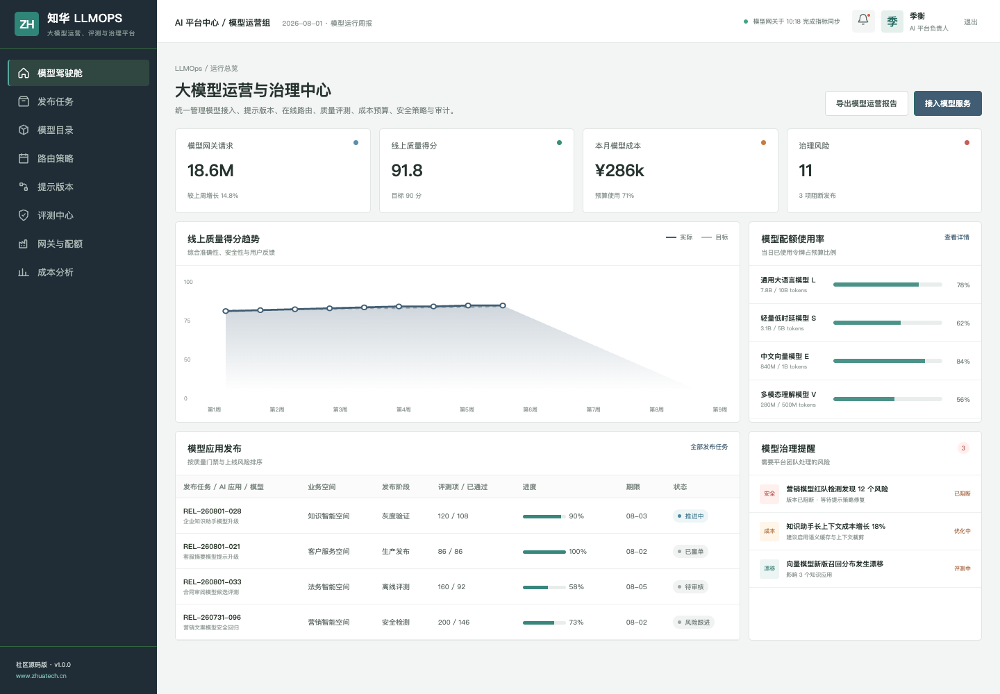
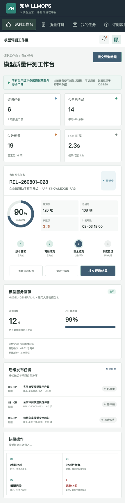

# ZhuaTech LLMOps

## 大模型运营、评测与治理平台｜社区源码版

ZhuaTech LLMOps 由知华科技（上海如静知华信息科技有限公司）发布，帮助企业把不同模型、提示版本、评测标准、发布流程、在线指标、成本预算与安全策略纳入统一治理。

[知华科技官网](https://www.zhuatech.cn/)　[架构说明](docs/architecture.md)　[API 摘要](docs/api.md)　[许可边界](LICENSE)

### 运营驾驶舱



驾驶舱提供模型网关请求量、线上质量、成本预算、发布版本、配额负载和治理风险，支持 AI 平台负责人观察质量、稳定性与投入产出。

### 评测工作台



评测人员围绕业务数据集执行准确性、鲁棒性、安全性、时延和成本评测，评测结果与模型、提示、参数和数据集快照永久关联。

### 能力清单

| 领域 | 社区版能力 |
| --- | --- |
| 模型目录 | Provider、能力、上下文、价格、配额和健康状态 |
| 提示工程 | 模板、变量、版本、差异和发布记录 |
| 模型评测 | 场景集、黄金答案、离线评测、红队与对照实验 |
| 发布治理 | 质量门禁、人工审批、灰度流量、回滚和审计 |
| 在线运营 | 请求、时延、错误、令牌、缓存、成本和用户反馈 |
| 安全治理 | 幻觉、越权、隐私、偏见与敏感输出风险 |

最新版本增加统一发布门禁接口，将质量分、安全分、P95 时延、单位推理成本和人工审批汇总为 `RELEASE` 或 `HOLD` 决策，并返回失败门禁与当前阈值，便于流水线直接消费。

### 运行方式

服务端使用 Java 21 + Spring Boot，Web/H5 使用 Vue 3，数据层使用 MySQL 8 与 Flyway，测试使用 H2。包名 `cn.zhuatech.llmops`，数据库 `zhuatech_llmops`。仓库只提供模型 Provider 边界与演示数据，不含真实模型 API Key。

```bash
cd frontend
npm install
npm run dev:demo
```

企业管理端 `planner / Demo@2026`，评测端 `operator / Demo@2026`。全栈部署执行 `cp .env.example .env && docker compose up --build`。

### 许可与商业合作

仅限个人学习、研究和非商业技术交流，未经上海如静知华信息科技有限公司书面授权不得商用。企业内部部署、SaaS、项目实施、收费培训、咨询服务、品牌替换和商业再分发均属于商业使用，详见 [LICENSE](LICENSE)。

大模型平台、模型网关、LLMOps、私有化部署和定制开发，请访问[知华科技官网](https://www.zhuatech.cn/)或扫码咨询：

| 技术与方案咨询 | 商务与授权咨询 |
| --- | --- |
|  |  |

SEO 关键词：LLMOps 开源、模型评测平台、大模型治理、模型网关、Prompt 管理、AI 成本治理、Java LLMOps、知华科技。

## 模型调用成本预测

新增 `POST /api/llmops/insights/model-cost-forecast`，根据月请求量、输入输出 Token、缓存命中率、模型单价和月度预算预测成本，并输出 `WITHIN_BUDGET / WARNING / OVER_BUDGET`。结果包含预算使用率及缓存、输出长度、模型路由等优化动作，方便上线前完成 FinOps 评审。
